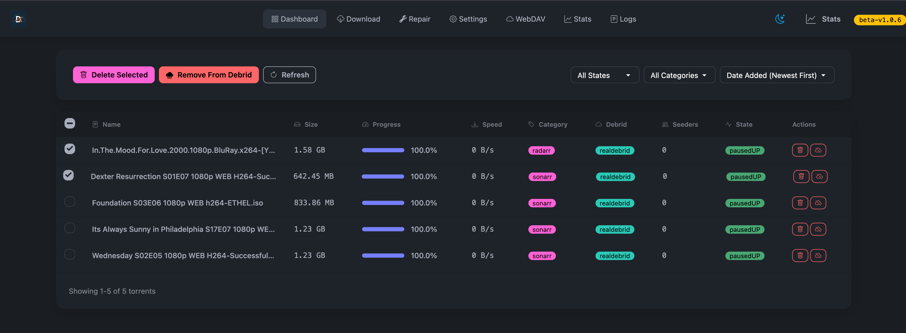

# Decypharr



**Decypharr** is an implementation of QbitTorrent with **Multiple Debrid service support**, written in Go.

## What is Decypharr?

Decypharr combines the power of QBittorrent with popular Debrid services to enhance your media management. It provides a familiar interface for Sonarr, Radarr, and other \*Arr applications.

## Features

- Mock Qbittorent API that supports the Arrs (Sonarr, Radarr, Lidarr etc)
- Full-fledged UI for managing torrents
- Multiple Debrid providers support
- WebDAV server support for each debrid provider
- Optional mounting of WebDAV to your system(using [Rclone](https://rclone.org/))
- Repair Worker for missing files

## Supported Debrid Providers

- [Real Debrid](https://real-debrid.com)
- [Torbox](https://torbox.app)
- [Debrid Link](https://debrid-link.com)
- [All Debrid](https://alldebrid.com)

## Quick Start

### Docker (Recommended)

```yaml
services:
  decypharr:
    image: cy01/blackhole:latest
    container_name: decypharr
    ports:
      - "8282:8282"
    volumes:
      - /mnt/:/mnt:rshared
      - ./configs/:/app # config.json must be in this directory
    restart: unless-stopped
    devices:
      - /dev/fuse:/dev/fuse:rwm
    cap_add:
      - SYS_ADMIN
    security_opt:
      - apparmor:unconfined
```

## Documentation

For complete documentation, please visit our [Documentation](https://sirrobot01.github.io/decypharr/).

The documentation includes:

- Detailed installation instructions
- Configuration guide
- Usage with Sonarr/Radarr
- WebDAV setup
- Repair Worker information
- ...and more!

## Basic Configuration

You can configure Decypharr through the Web UI or by editing the `config.json` file directly.

### Torbox Rate Limit Configuration

Torbox has specific API rate limits that must be respected to avoid service interruptions:

- **General API**: 5 requests/second per IP
- **POST /torrents/createtorrent**: 60 requests/hour per IP and 10 requests/minute at edge
- **POST /usenet/createusenetdownload**: 60 requests/hour per IP and 10 requests/minute at edge
- **POST /webdl/createwebdownload**: 60 requests/hour per IP and 10 requests/minute at edge

#### Recommended Torbox Configuration

```json
{
  "debrid": [
    {
      "name": "torbox",
      "api_key": "your_torbox_api_key",
      "rate_limit": "4/second",
      "repair_rate_limit": "4/second",
      "download_rate_limit": "4/second"
    }
  ]
}
```

**Important Notes:**
- Use conservative rate limits (4/second) to stay safely under the 5/second general API limit
- Decypharr automatically validates and corrects rate limits that exceed Torbox's API limits
- For high-volume usage, consider implementing delays between batch operations
- The system will log warnings if configured rate limits exceed API maximums

## Contributing

Contributions are welcome! Please feel free to submit a Pull Request.

## License
This project is licensed under the MIT License. See the [LICENSE](LICENSE) file for details.