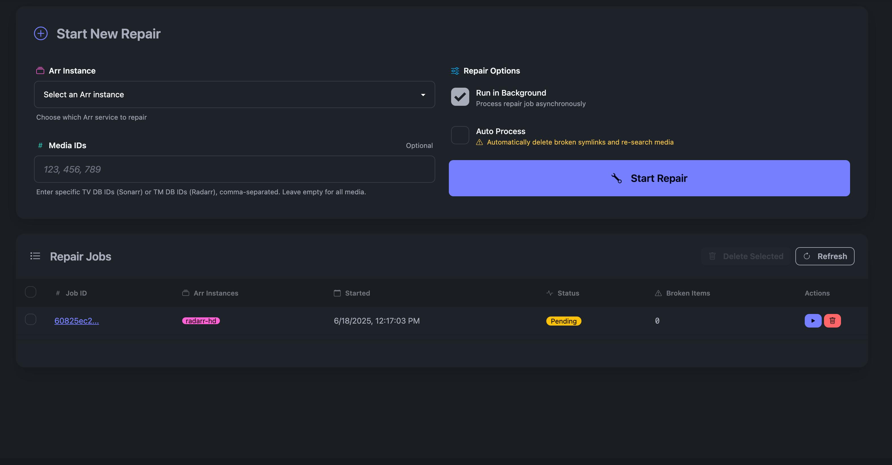

# Repair Worker



The Repair Worker is a powerful feature that helps maintain the health of your media library by scanning for and fixing issues with files.

## What It Does

The Repair Worker performs the following tasks:

- Searches for broken symlinks or file references
- Identifies missing files in your library
- Locates deleted or unreadable files
- Automatically repairs issues when possible

## Configuration

To enable and configure the Repair Worker, add the following to your `config.json`:

```json
"repair": {
  "enabled": true,
  "interval": "12h",
  "use_webdav": false,
  "zurg_url": "http://localhost:9999",
  "auto_process": true
}
```

### Configuration Options

- `enabled`: Set to `true` to enable the Repair Worker.
- `interval`: The time interval for the Repair Worker to run (e.g., `12h`, `1d`).
- `use_webdav`: If set to `true`, the Repair Worker will use WebDAV for file operations.
- `zurg_url`: The URL for the Zurg service (if using).
- `auto_process`: If set to `true`, the Repair Worker will automatically process files that it finds issues with.


### Performance Tips
- For users of the WebDAV server, enable `use_webdav` for exponentially faster repair processes
- If using Zurg, set the `zurg_url` parameter to greatly improve repair speed