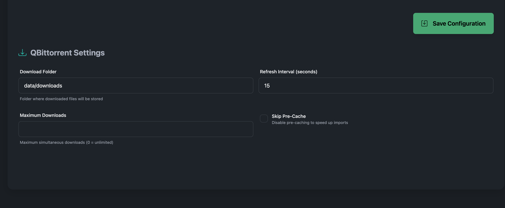
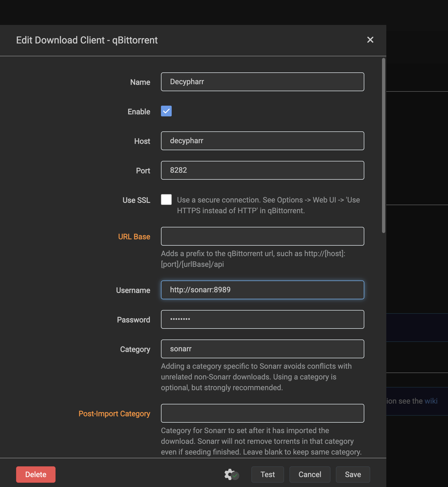

# Usage Guide

This guide will help you get started with Decypharr after installation.

After installing Decypharr, you can access the web interface at `http://localhost:8282` or your configured host/port.

### Initial Configuration
If it's the first time you're accessing the UI, you will be prompted to set up your credentials. You can skip this step if you don't want to enable authentication. If you choose to set up credentials, enter a username and password confirm password, then click **Save**. You will be redirected to the settings page.

### Debrid Configuration
   
- Click on **Debrid** in the tab
- Add your desired Debrid services (Real Debrid, Torbox, Debrid Link, All Debrid) by entering the required API keys or tokens.
- Set the **Mount/Rclone Folder**. This is where decypharr will look for added torrents to symlink them to your media library.
   - If you're using internal webdav, do not forget the `/__all__` suffix
- Enable WebDAV
- **Configure Rate Limits**: Set appropriate rate limits for each provider to avoid API throttling.

#### Rate Limit Configuration

Each debrid provider has different API rate limits. Configure these carefully to ensure smooth operation:

**Torbox Rate Limits (Critical)**:
- **General API**: 5 requests/second per IP
- **Torrent Creation**: 60 requests/hour + 10 requests/minute
- **Recommended Settings**:
  - Rate Limit: `4/second` (conservative, stays under 5/sec limit)
  - Repair Rate Limit: `4/second`
  - Download Rate Limit: `4/second`

**Other Providers**:
- **Real Debrid**: `200/minute` (generally safe)
- **Debrid Link**: `100/minute` (moderate usage)
- **All Debrid**: `100/minute` (moderate usage)

**Best Practices**:
- Always use conservative rate limits to avoid hitting API maximums
- Decypharr automatically validates and corrects excessive rate limits
- Monitor logs for rate limit warnings
- For high-volume usage with large torrents (50+ files), consider lower rate limits

### Qbittorent Configuration
   

- Click on **Qbittorrent** in the tab
- Set the **Download Folder** to where you want Decypharr to save downloaded files. These files will be symlinked to the mount folder you configured earlier.
You can leave the remaining settings as default for now.

### Arrs Configuration

You can skip Arr configuration for now. Decypharr will auto-add them when you connect to Sonarr or Radarr later.

#### Connecting to Sonarr/Radarr

To connect Decypharr to your Sonarr or Radarr instance:

1. In Sonarr/Radarr, go to **Settings → Download Client → Add Client → qBittorrent**
2. Configure the following settings:
   - **Host**: `localhost` (or the IP of your Decypharr server)
   - **Port**: `8282` (or your configured qBittorrent port)
   - **Username**: `http://sonarr:8989` (your Arr host with http/https)
   - **Password**: `sonarr_token` (your Arr API token, you can get this from Sonarr/Radarr settings)
   - **Category**: e.g., `sonarr`, `radarr` (match what you configured in Decypharr)
   - **Use SSL**: `No`
   - **Sequential Download**: `No` or `Yes` (if you want to download torrents locally instead of symlink)
3. Click **Test** to verify the connection
4. Click **Save** to add the download client

### Rclone Configuration

If you want Decypharr to automatically mount WebDAV folders using Rclone, you need to set up Rclone first:

If you're using Docker, the rclone binary is already included in the container. If you're running Decypharr directly, make sure Rclone is installed on your system.

Enable **Mount**
  - **Global Mount Path**: Set the path where you want to mount the WebDAV folders (e.g., `/mnt/remote`). Decypharr will create subfolders for each Debrid service. For example, if you set `/mnt/remote`, it will create `/mnt/remote/realdebrid`, `/mnt/remote/torbox`, etc. This should be the grandparent of your mount folder set in the Debrid configuration.
  - **User ID**: Set the user ID for Rclone mounts (default is gotten from the environment variable `PUID`).
  - **Group ID**: Set the group ID for Rclone mounts (default is gotten from the environment variable `PGID`).
  - **Buffer Size**: Set the buffer size for Rclone mounts.

You should set other options based on your use case. If you don't know what you're doing, leave it as defaults. Checkout the [Rclone documentation](https://rclone.org/commands/rclone_mount/) for more details.

### Repair Configuration

Repair is an optional feature that allows you to fix missing files, symlinks, and other issues in your media library.
- Click on **Repair** in the tab
- Enable **Scheduled Repair** if you want Decypharr to automatically check for missing files at your specified interval.
- Set the **Repair Interval** to how often you want Decypharr to check for missing files (e.g 1h, 6h, 12h, 24h, you can also use cron syntax like `0 0 * * *` for daily checks).
- Enable **WebDav**(You shoukd enable this, if you enabled WebDav in Debrid configuration)
- **Auto Process**: Enable this if you want Decypharr to automatically process repair jobs when they are done. This could delete the original files, symlinks, be wary!!!
- **Worker Threads**: Set the number of worker threads for processing repair jobs. More threads can speed up the process but may consume more resources.